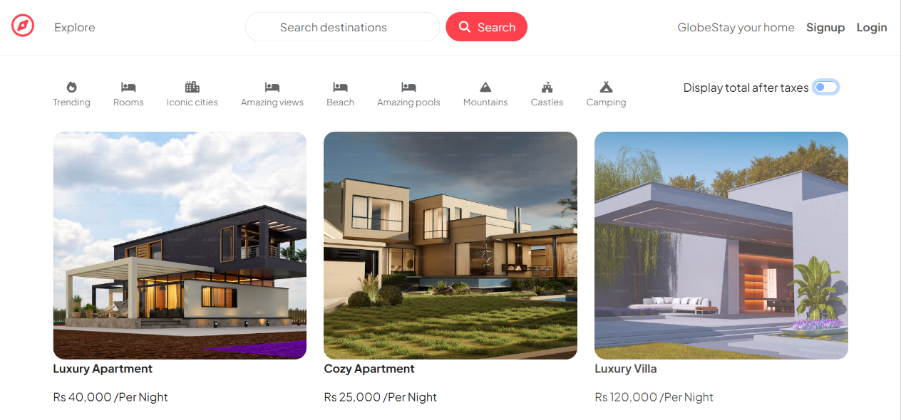
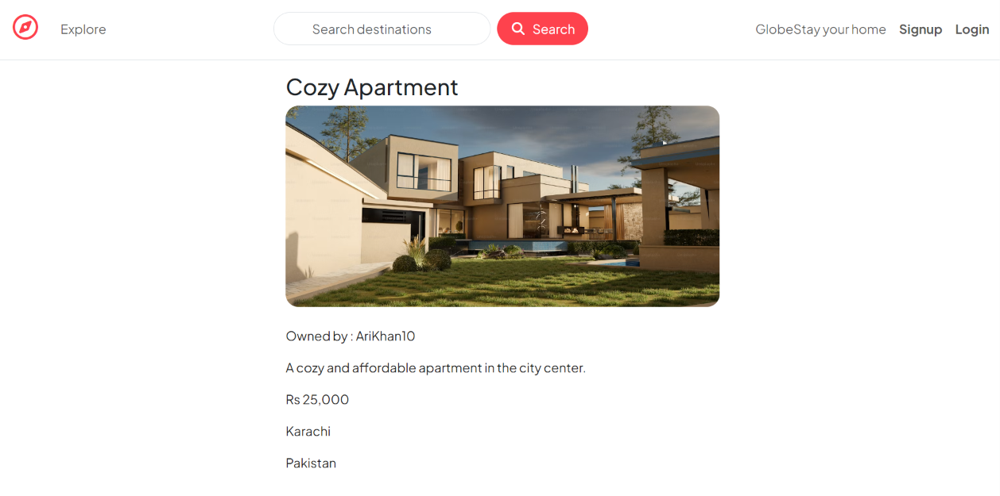
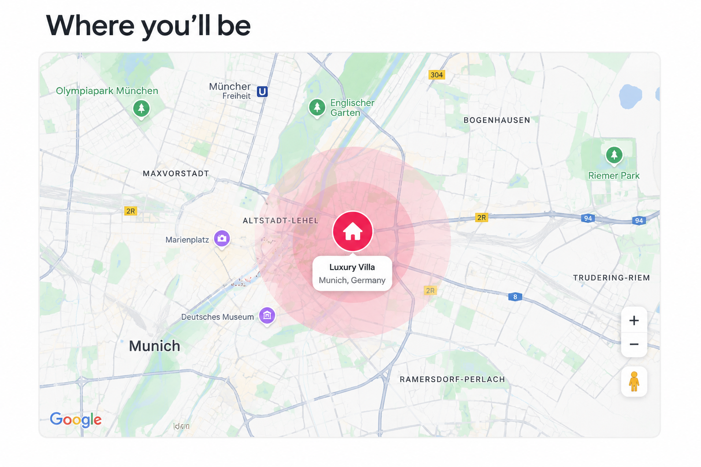

# 🌍 GlobeStay

**A full-stack travel listing web app where users can discover, list, and review stays around the world.**

[](https://nodejs.org/)
[](https://expressjs.com/)
[](https://www.mongodb.com/)
[](https://ejs.co/)
[](https://cloudinary.com/)

GlobeStay is a full-stack travel listing web app built with Node.js, Express, MongoDB, and EJS. Users can sign up, log in, create listings with images, add reviews, and manage their own content.

## Table of Contents

- [Features](#features)
- [Tech Stack](#tech-stack)
- [Screenshots](#screenshots)
- [Project Structure](#project-structure)
- [Getting Started](#getting-started)
- [API Routes](#api-routes)
- [Data Models](#data-models)
- [Contributing](#contributing)
- [License](#license)
- [Author](#author)

## Features

- User authentication (signup, login, logout)
- Create, read, update, and delete travel listings
- Upload listing images to Cloudinary
- Add and delete reviews on listings
- Authorization checks:
  - Only logged-in users can create listings/reviews
  - Only listing owners can edit/delete their listings
  - Only review authors can delete their reviews
- Server-side validation for listings and reviews using Joi
- Flash messages for success/error feedback
- Global error handling with a custom Express error class

## Tech Stack

| Category | Technology |
|---|---|
| Backend | Node.js, Express |
| Database | MongoDB, Mongoose |
| Authentication | Passport.js, passport-local, passport-local-mongoose |
| Views / Templating | EJS, ejs-mate |
| Validation | Joi |
| File Uploads | Multer, Cloudinary, multer-storage-cloudinary |
| Session & Flash Messages | express-session, connect-flash |
| Geocoding | Google Maps Geocoding API |

## Screenshots

| Home Page | Listing Details |
|---|---|
|  |  |
| Map| Review |
|  |  |
## Project Structure

```text
.
├── controllers/
│   ├── listing.js
│   ├── review.js
│   └── user.js
├── init/
│   ├── data.js
│   └── index.js
├── models/
│   ├── listing.js
│   ├── review.js
│   └── user.js
├── public/
│   ├── css/
│   └── js/
├── routes/
│   ├── listing.js
│   ├── review.js
│   └── user.js
├── utils/
│   ├── expressError.js
│   └── wrapasync.js
├── views/
│   ├── includes/
│   ├── layouts/
│   ├── listing/
│   └── user/
├── cloudConfig.js
├── index.js
├── middleware.js
├── package.json
└── scehma.js
```

## Getting Started

### Prerequisites

- Node.js (v18+ recommended)
- A Cloudinary account
- A Google Maps Geocoding API key

### 1. Clone the repository

```bash
git clone https://github.com/Aryankhanf22/GlobeStay.git
cd globestay
```

### 2. Install dependencies

```bash
npm install
```

### 3. Configure environment variables

Create a `.env` file in the project root:

```env
#Mongodb
MONGODB_URI=your_MONGODB_URI

# Cloudinary
CLOUD_NAME=your_cloud_name
CLOUD_API_KEY=your_cloudinary_api_key
CLOUD_API_SECRET=your_cloudinary_api_secret

# Google Maps Geocoding API
MAP_KEY=your_google_maps_api_key
```

### 4. Seed the database (optional)

```bash
node init/index.js
```

### 5. Run the app

```bash
node server.js
```

The server will start on:

```
http://localhost:8080
```

## API Routes

### Listing Routes

| Method | Route | Description | Access |
|---|---|---|---|
| GET | `/listing` | Show all listings | Public |
| GET | `/listing/new` | New listing form | Logged in |
| POST | `/listing` | Create listing | Logged in |
| GET | `/listing/:id` | Show one listing | Public |
| GET | `/listing/:id/edit` | Edit form | Owner only |
| PUT | `/listing/:id` | Update listing | Owner only |
| DELETE | `/listing/:id` | Delete listing | Owner only |

### Review Routes

| Method | Route | Description | Access |
|---|---|---|---|
| POST | `/listing/:id/reviews` | Create review | Logged in |
| DELETE | `/listing/:id/reviews/:reviewId` | Delete review | Author only |

### User Routes

| Method | Route | Description |
|---|---|---|
| GET | `/signup` | Signup form |
| POST | `/signup` | Register user |
| GET | `/login` | Login form |
| POST | `/login` | Authenticate user |
| GET | `/logout` | Logout user |

## Data Models

### Listing

| Field | Type | Notes |
|---|---|---|
| `title` | String | Required |
| `description` | String | |
| `image` | Object | `{ url, filename }` |
| `price` | Number | |
| `location` | String | |
| `country` | String | |
| `reviews` | [ObjectId] | References to `Review` documents |
| `owner` | ObjectId | Reference to `User` document |
| `geometry` | GeoJSON Point | Coordinates from geocoding |

### Review

| Field | Type | Notes |
|---|---|---|
| `comment` | String | Required |
| `rating` | Number | 0–5 |
| `createdate` | Date | |
| `author` | ObjectId | Reference to `User` document |

### User

| Field | Type | Notes |
|---|---|---|
| `email` | String | Required, unique |
| `username` | String | Managed by `passport-local-mongoose` |
| `password` | String | Hashed, managed by `passport-local-mongoose` |

## Contributing

Contributions, issues, and feature requests are welcome.

1. Fork the project
2. Create your feature branch (`git checkout -b feature/AmazingFeature`)
3. Commit your changes (`git commit -m 'Add some AmazingFeature'`)
4. Push to the branch (`git push origin feature/AmazingFeature`)
5. Open a pull request

## License

This project is licensed under the terms specified in the [LICENSE](./LICENSE) file.

## Author

**Aryan Khan**

- GitHub: https://github.com/Aryankhanf22
- LinkedIn: www.linkedin.com/in/aryankhan-f22
